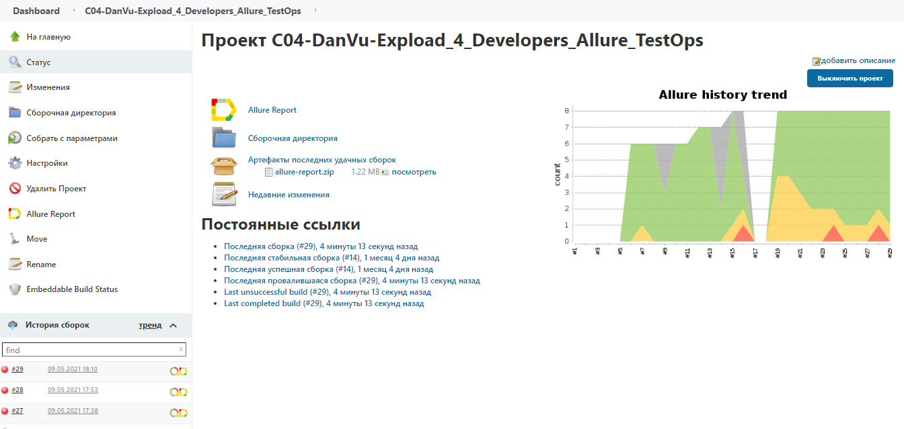
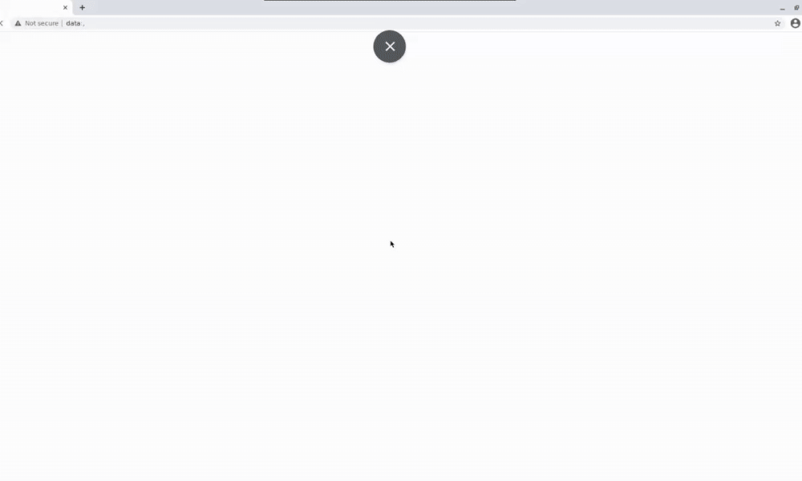
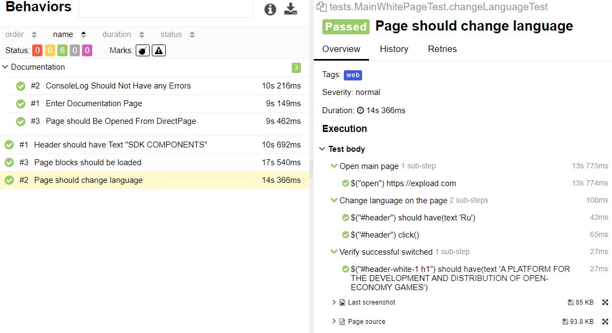
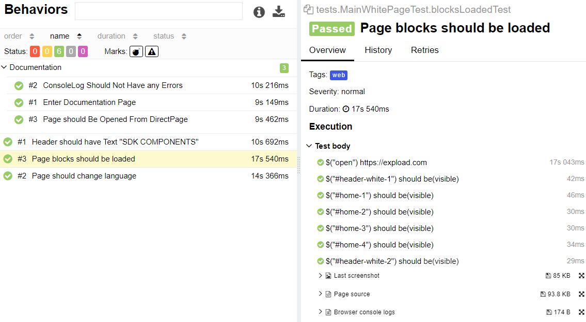
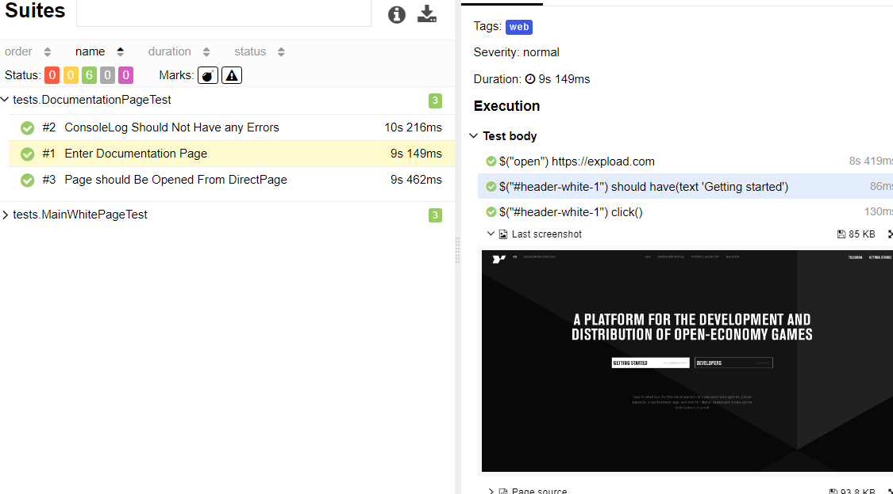
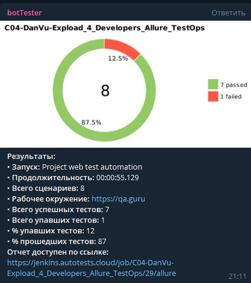
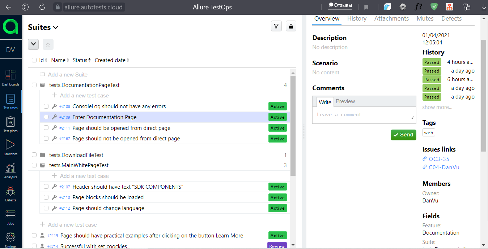
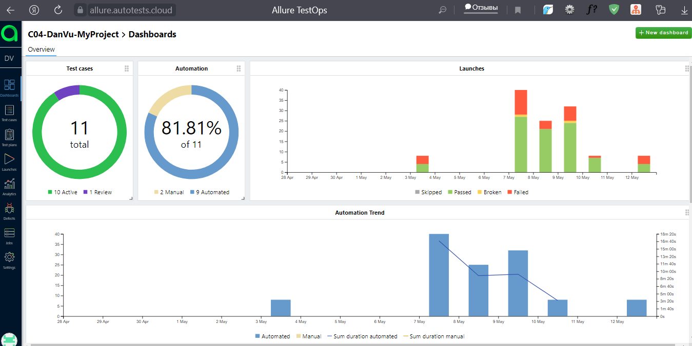
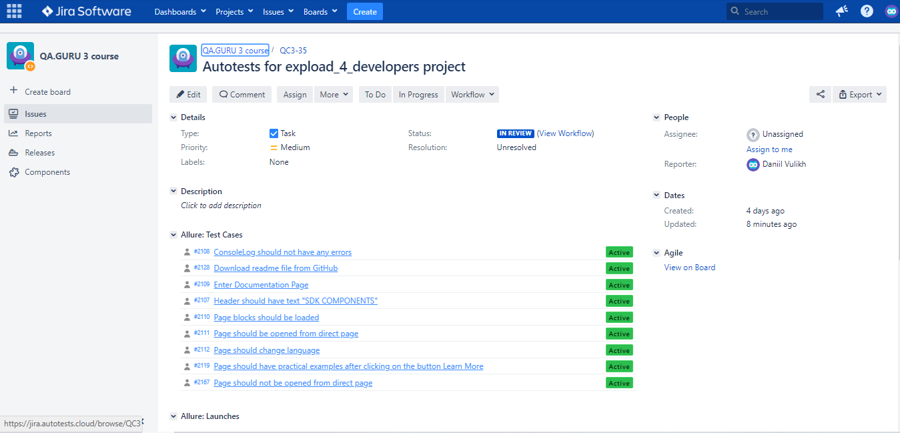

# E2E Automation project (WEB): https://expload.com/ :ghost:

## Technology Stack

### Infrastructure:

## UI tests:

- [X] :mango: Main page tests 
- [X] :banana: Page should Be Opened From Direct Page 
- [X] :orange: Console Log Should Not Have any Errors 
- [X] :strawberry: Header should have Text "SDK COMPONENTS" 
- [X] :watermelon: Page should change language EN/RU 
- [X] :grapes: Download readme file from GitHub and search for the desired text in it 

## Screenshots
#### *Jenkins - it is an open source automation server:*

#### *Test Video:*

#### *Allure Report - it is a flexible lightweight test report tool:*

#### *Telegram notifications:*

#### *Allure TestOps - it is a TMS that allows to manage all test related stuff in one place:*

#### *Jira integration:*

### Contacts:

